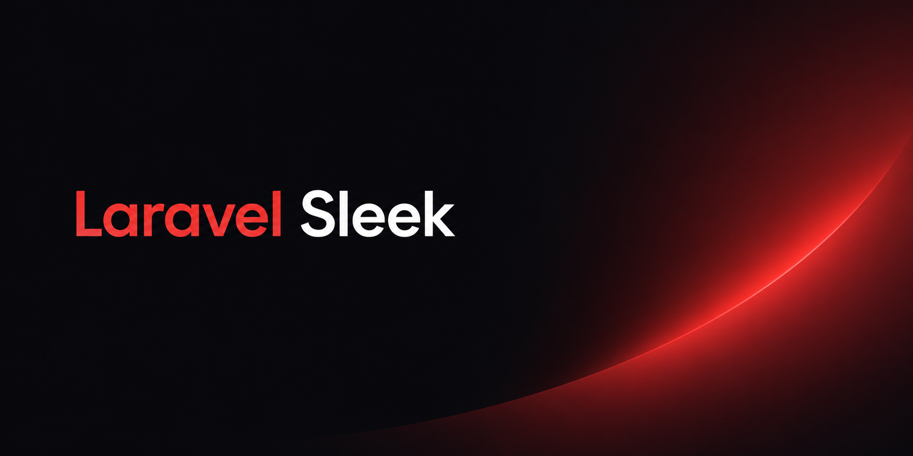

<p align="center">
    
</p>

# Introduction

JSX-style component syntax for Laravel Blade.

```blade
<Layouts.App>
    <Form method="POST" action="{{ route('login') }}">
        <Form.Group>
            <Form.Label>Email</Form.Label>
            <Form.Input type="email" name="email" />
        </Form.Group>

        <Button type="submit">Sign in</Button>
    </Form>
</Layouts.App>
```

## Installation

```bash
composer require harrisonclewis/laravel-sleek
```

## Usage

PascalCase tags are transformed to Laravel's `x-component` syntax at compile time.

```blade
<Button />               →  <x-button />
<UserProfile />          →  <x-user-profile />
<Form.Input />           →  <x-form.input />
<Card.Body class="p-4">  →  <x-card.body class="p-4">
```

Standard HTML tags (`div`, `span`, `p`, etc.) are never transformed.

## Configuration

Publish the config file if you need to adjust defaults:

```bash
php artisan vendor:publish --tag=sleek-config
```

```php
// config/sleek.php
return [
    'enabled'     => true,
    'ignore_tags' => [ /* additional tags to leave untouched */ ],
];
```

## Requirements

- PHP ^8.1
- Laravel ^10.0|^11.0|^12.0|^13.0

## License

MIT
